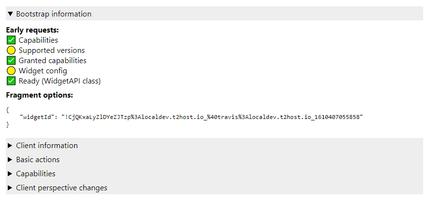

# widget debug widget

A Matrix widget to debug widget interactions on a widget-supporting client through widgets.

## Usage

These are static assets, so they can be served anywhere. For cheap and easy local deployment,
something like [http-server](https://www.npmjs.com/package/http-server) will help a lot.

Once running, add `http://localhost:8081/index.html#/?widgetId=$matrix_widget_id` (with whatever
additional arguments for testing parsing/passing of variables) to a room and open the widget.

Normal operation looks something like this:

Click around to see various options. It's largely undocumented at the moment, but may be
self-documenting in places.

*Note*: Please pardon the mixed use of regular JS and jQuery. One day I'll be decisive, but that
day is not today.
